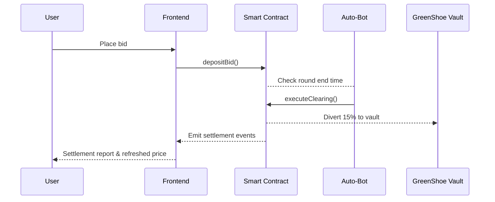

# Dabanc Launchpad Protocol · Institutional RWA Launchpad 🚀

  

Dabanc is an institutional-grade RWA issuance platform simulating a fair launch for **SpaceX Equity Tokens (wSPX)** on Sepolia. The protocol combines a discrete batch auction to stop MEV/gas wars with an on-chain green shoe mechanism to dampen post-settlement volatility.

Key capabilities:
- ⏱️ **5-Minute Batch Auction:** Orders are accumulated for 5 minutes; a uniform clearing price is computed off-chain and settled on-chain with `Price = Total Raised / Token Supply`, avoiding AMM-style race conditions.
- 🛡️ **Green Shoe Stabilization:** 15% of raised capital is automatically routed to `GreenShoeVault` on settlement to support price stability instead of flowing to the project owner.
- 🤖 **Hybrid Architecture:** A Node.js keeper (`scripts/auto_bot.ts`) watches the clock and triggers `executeClearing` when a round ends.
- 📈 **Real-Time Pricing Engine:** Frontend streams pool size and shows the estimated clearing price as bids arrive.
- ✅ **KYC/Whitelist:** `onlyWhitelisted` gating blocks bids from non-approved wallets.

## Architecture Overview

## Technology Stack

- **Backend:** Solidity 0.8.20, Hardhat, Ethers.js
- **Frontend:** Next.js 14, RainbowKit, Wagmi v2, Viem

## Getting Started

### Prerequisites

- Node.js LTS
- MetaMask connected to Sepolia
- Alchemy Sepolia API key

### Backend Setup

1) `cd backend` then install deps: `npm install`  
2) Create `.env` with:
   - `PRIVATE_KEY=your_deployer_key`
   - `SEPOLIA_RPC_URL=https://eth-sepolia.g.alchemy.com/v2/<KEY>`
3) Compile contracts: `npx hardhat compile`
4) Deploy to Sepolia:  
   `npx hardhat run scripts/deploy_sepolia.ts --network sepolia`
5) **Whitelist users (critical or bids will revert with gas errors):**  
   `npx hardhat run scripts/whitelist_user.ts --network sepolia`  
   Run this for each wallet that should be allowed to bid.
6) Start the keeper/oracle bot in a separate terminal:  
   `npx hardhat run scripts/auto_bot.ts --network sepolia`  
   The bot checks when a 5-minute window closes and calls `executeClearing`.

### Frontend Setup

1) `cd frontend` then install deps: `npm install`  
2) Update deployment addresses in `constants.ts` (`Auction`, `USDC`, `wSPX`, `GreenShoeVault`).  
3) Run the app: `npm run dev` and open the provided local URL.

## Usage Guide (The Demo Flow)

1) Connect your wallet to Sepolia in the UI.  
2) Grab mock USDC from the faucet link in the app.  
3) Approve USDC and place a bid; watch the estimated clearing price move in real time.  
4) Wait for the bot terminal to show `executeClearing` once the 5-minute round ends.  
5) The frontend auto-refreshes and shows the 🟩 Settlement Report card with the clearing price and green shoe allocation.  
6) As admin, click **Start Next Round** to reset and begin the next batch.

## Troubleshooting

- **Error:** "Transaction gas limit too high" → **Solution:** Your wallet is not whitelisted. Run `scripts/whitelist_user.ts` for that address.  
- **Error:** "Buttons not working" → **Solution:** Ensure `scripts/auto_bot.ts` is running in another terminal so settlements can progress.

## Deployed Contracts (Sepolia)

| Contract         | Address |
| ---------------- | -------- |
| Auction          | `0x...` |
| USDC             | `0x...` |
| wSPX             | `0x...` |
| GreenShoeVault   | `0x...` |
